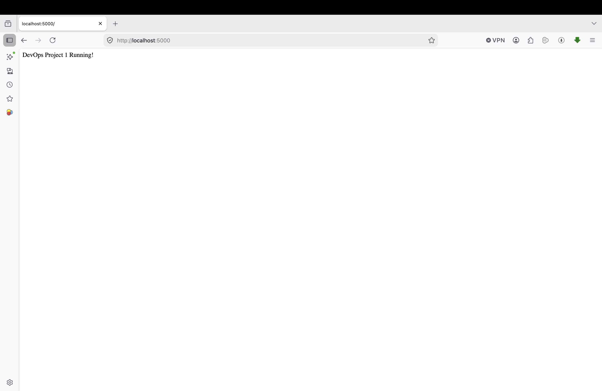
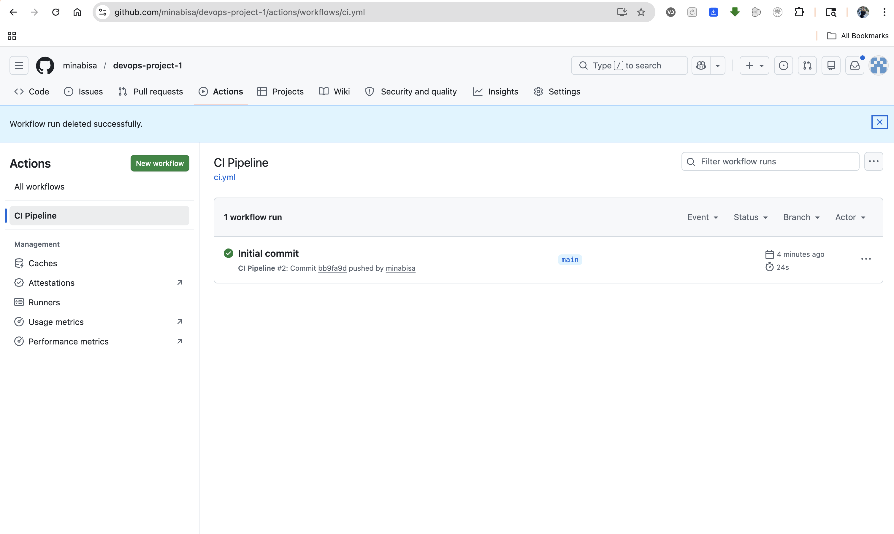

# 🚀 DevOps CI/CD Pipeline with Docker & GitHub Actions

## 📌 Overview
This project demonstrates a CI/CD pipeline that builds and pushes a Dockerized Flask app using GitHub Actions.

## 🛠️ Tools
Docker, GitHub Actions, Python, DockerHub

## ⚙️ Workflow
- Push code → GitHub
- Pipeline runs
- Docker image built
- Image pushed to DockerHub

## ▶️ Run
docker build -t flask-app .
docker run -p 5000:5000 flask-app

## 📸 Screenshots

### App Running

### CI/CD Pipeline

### DockerHub Image

## 🎯 Learning
CI/CD, Docker, automation

## 👨‍💻 Author
Mina Bisa
